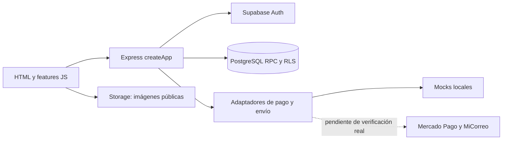

# MateBreak

MateBreak es una tienda minorista de mates y accesorios con catálogo por variantes, carrito, checkout, inventario físico y administración. Resuelve la diferencia entre vender una publicación comercial (por ejemplo, un set personalizado) y reservar las piezas físicas que realmente la componen.

Es un proyecto de portfolio para estudiar frontend, APIs, autenticación y transacciones. La lógica financiera y de stock se valida en el backend/PostgreSQL; el navegador presenta datos y recoge decisiones del comprador.

## Tecnologías y arquitectura

HTML, CSS y JavaScript ES modules, sin framework frontend; Node.js 22+, Express 5, Supabase PostgreSQL/Auth/Storage, SDK Supabase y SSR para cookies; Cheerio para extracción de catálogo. Node test runner y SQL prueban contratos y concurrencia. Docker Desktop aloja Supabase local y PostgreSQL descartable. GitHub Actions ejecuta controles offline, sin deploys añadidos.



```text
index.html                    Entrada pública
src/
  features/account/           Cuenta, administración y ventas
  features/catalog/           Catálogo y detalle
  features/cart/              Carrito
  features/checkout/          Compra y resultado
  js/                         Interacciones del sitio y entradas compatibles
  services/                   Consulta pública de productos
  pages/ css/ assets/          HTML, estilos y multimedia
server/
  index.mjs app.mjs            Arranque y composición de Express
  config/                     Lectura y validación de entorno
  modules/auth/ cart/          Rutas de autenticación y carrito
  modules/account/            Perfil, direcciones, permisos y operación
  modules/catalog/ inventory/ Catálogo e inventario
  checkout/                   Orquestación y política comercial
  payments/                   Adaptadores, webhook y transferencias
  shipping/                   Embalaje, MiCorreo, snapshots, jobs y administración
  integrations/supabase/      Adaptador de cookies Auth
  jobs/                       Expiración de reservas
  private-ui/                 Pantallas internas protegidas
supabase/                     config, migrations, platform y tests/fixtures
scripts/                      Importación, auditoría y tests locales
 tests/                       Node, concurrencia y seguridad
 docs/                        Guías, contratos y evidencia
.github/workflows/            CI
```

Se mantienen `src/` y `server/`: renombrarlos no aportaría una responsabilidad nueva y cambiaría innecesariamente contratos estáticos y scripts. `src/js/` conserva entradas compatibles; las implementaciones de comercio están en `src/features/`. No hay carpetas vacías ni un framework nuevo. Ver [decisiones y árboles completos](docs/architecture.md), [inventario de movimientos](docs/refactor/moves.json) y [mapa de dependencias](docs/refactor/after.json).

## Instalar y ejecutar localmente

Requisitos: Node.js 22+, npm y Docker Desktop con el motor Linux activo. Desde este checkout:

```bash
npm ci
npm run supabase:start
```

Copiá `.env.example` a `.env` solo si no existe. Completá las claves generadas por el stack **local**, según [desarrollo local](docs/local-development.md). No copiar credenciales productivas. Luego:

```bash
npm run dev
```

El mismo proceso sirve frontend y backend en `http://localhost:3000`. No hace falta un servidor frontend separado. `npm start` inicia el mismo backend con el entorno elegido. Live Server no reproduce API ni cookies. `npm run build:frontend` genera exclusivamente `dist/index.html` y `dist/src/` para un futuro hosting estático; requiere el proxy descrito en [hosting](docs/hosting.md).

Rutas públicas: `/`, `/tienda`, `/productos/:slug`, `/carrito`, `/checkout`, `/checkout/resultado`, `/mi-cuenta`. Pantallas internas: `/interno/inventario` y `/interno/logistica`, con autenticación y autorización. `/healthz` informa disponibilidad del proceso; no certifica la conexión a PostgreSQL.

## Variables de entorno

Los nombres necesarios para el arranque son `SUPABASE_URL`, `SUPABASE_PUBLISHABLE_KEY`, `SUPABASE_SECRET_KEY`, `APP_ORIGIN`; `PORT` y `NODE_ENV` controlan ejecución. Alias compatibles: `SUPABASE_ANON_KEY` y `SUPABASE_SERVICE_ROLE_KEY`.

| Grupo | Nombres |
| --- | --- |
| Local y mocks | `MATEBREAK_LOCAL_ONLY`, `SHIPPING_MODE`, `PAYMENTS_MODE`, `MOCK_PAYMENT_RESULT`, `MOCK_ORIGIN_POSTAL_CODE`, `MATEBREAK_LOCAL_PERSIST_MOCK`, `MATEBREAK_LOCAL_PICKUP_MOCK` |
| Mercado Pago | `MP_ACCESS_TOKEN`, `MERCADOPAGO_ACCESS_TOKEN` (alias), `MERCADOPAGO_WEBHOOK_SECRET`; `MP_PUBLIC_KEY` está en el ejemplo original, pero este backend no la utiliza |
| MiCorreo | `CORREO_MICORREO_ENVIRONMENT`, `CORREO_ENVIRONMENT` (alias), `CORREO_MICORREO_USER`, `CORREO_MICORREO_PASSWORD`, `CORREO_MICORREO_CUSTOMER_ID`, `CORREO_ORIGIN_POSTAL_CODE` |
| Embalaje aprobado | `CORREO_VERIFIED_PARCELS_JSON`, `CORREO_APPROVED_RETAIL_PROFILES_JSON` |

Esta iteración preserva `.env.example` byte por byte. Los perfiles nuevos y la separación de entornos se explican en [embalaje](docs/packaging.md) y [hosting](docs/hosting.md). Secretos y datos de clientes no deben llegar al bundle ni a logs.

## Pruebas

```bash
npm test
npm run test:architecture
npm run catalog:historical:check
node scripts/audit-baseline.mjs --check
npm audit
npm run supabase:start
npm run test:full
npm run supabase:start
npm run test:baseline:local
```

`test:full` usa exclusivamente el stack local propiedad de este checkout y PostgreSQL descartable. Incluye SQL histórico 18/18, logística, privilegios, stock concurrente 20/20, lifecycle 9/9, checkout concurrente 2/2, Auth/JWT/RLS y Storage. Hace reset local de limpieza y detiene Supabase; por eso hay que iniciarlo otra vez antes del rehearsal. El rehearsal reconstruye y compara el baseline local, verifica fallo intermedio/convergencia y vuelve a detener el stack. Son pruebas destructivas **solo sobre fixtures locales descartables**, nunca sobre un proyecto remoto.

Para finalizar una sesión local: `npm run supabase:stop`. Los guards rechazan credenciales heredadas, URLs remotas y contenedores de otros checkouts. Los [resultados de esta iteración](docs/refactor/validation.md) distinguen verificaciones ejecutadas de limitaciones.

## Estado funcional

| Funcionalidad | Estado |
| --- | --- |
| Catálogo, variantes, carrito, cuenta, roles, inventario | Implementados y cubiertos por Node/SQL/Auth local |
| Compra directa y checkout | Implementados; recorrido local con mocks y persistencia opcional de pedidos/reservas reales en PostgreSQL local |
| Pago approved/rejected/pending | Verificado con mocks; no equivale a un cobro real |
| Transferencias | Flujo de confirmación administrativa implementado; operación bancaria real pendiente |
| Cotización, snapshot, importación y recuperación MiCorreo | Contratos HTTP y flujo local/mock probados; tarifas, cuenta y despacho reales pendientes |
| Entrega a sucursal | Restringida al modo local/mock explícito; agencias ficticias |
| Pedidos grandes y mixtos | Uno/dos bultos si hay perfiles aprobados; descarga para cotización manual si faltan |
| Mayorista | Futuro: edición manual por bulto, tipos de caja y más de dos paquetes |

Los mocks normales usan pedidos efímeros y no reservan stock. `MATEBREAK_LOCAL_PERSIST_MOCK` activa un recorrido local que sí reserva stock y persiste pedidos usando RPC reales, con proveedores simulados. Producción rechaza proveedores mock.

## Producción y próximos pasos

No se publicó la tienda ni se conectaron proveedores. Faltan verificaciones con credenciales de prueba oficiales, mediciones de embalajes grandes, sender y procesos operativos/logísticos reales, ensayo de proxy/cookies en staging y aprobación manual de producción. Las pruebas locales no acreditan esas integraciones.

Supabase Deploy to production permanece **OFF por decisión manual del responsable**, según su instrucción para esta iteración; no se inspeccionó ni modificó la configuración externa. Los documentos anteriores que describen un bloqueo con deploy ON son evidencia histórica de la RC. Se conserva su contenido, pero no representan el estado comunicado para esta iteración.

La rama nueva deriva de `4870fc7`; su PR apunta a `local-supabase-validation`, sin merge a `main`, migraciones remotas ni deploy automático. Ver [seguridad](docs/security-architecture.md), [runbook de producción](docs/production-release-runbook.md), [guía para estudiar](docs/learning-guide.md) y [diagramas de flujos](docs/flows.md).
