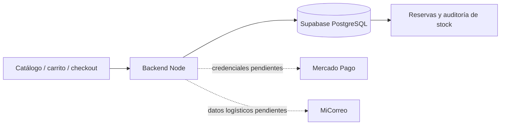

# MateBreak

**Tienda minorista de mates y accesorios** con catálogo, carrito, checkout, inventario físico y operación interna. El proyecto combina una interfaz adaptable con reglas comerciales verificadas en el servidor y reservas transaccionales en PostgreSQL.

> **Estado:** catálogo y stock validados; el checkout minorista está preparado. Los pagos reales y las tarifas de Correo Argentino permanecen deshabilitados hasta conectar y probar las credenciales oficiales.

| Área | Qué hace | Código principal |
| --- | --- | --- |
| Tienda | 106 productos, 217 variantes y 56 combos; detalle por `/productos/:slug` | [`server/catalog.mjs`](server/catalog.mjs), [`src/js/catalog-ui.js`](src/js/catalog-ui.js) |
| Compra | Carrito, compra directa separada, Entrega → Pago y resumen editable | [`server/checkout/`](server/checkout/), [`src/js/checkout.js`](src/js/checkout.js) |
| Inventario | Composición física, cajas, stock, reservas y expiración | [`supabase/migrations/`](supabase/migrations/), [`server/inventory.mjs`](server/inventory.mjs) |
| Pagos | Transferencia manual y adaptador seguro para Mercado Pago Checkout Pro | [`server/payments/`](server/payments/) |
| Envío | Adaptador de la API oficial MiCorreo; cotizaciones guardadas con el pedido | [`server/shipping/correo-argentino.mjs`](server/shipping/correo-argentino.mjs) |
| Administración | Roles, ventas, preparación, inventario y revisión de transferencias | [`server/account.mjs`](server/account.mjs), [`src/js/account-admin.js`](src/js/account-admin.js) |



## Ejecutar localmente

Requiere **Node.js 22+** y un proyecto Supabase configurado. Copiá `.env.example` a `.env`, completá las variables de Supabase y ejecutá:

```bash
npm install
npm start
```

La app se abre en `http://localhost:3000/`. Rutas principales: `/tienda` para el catálogo, `/carrito` para la selección, `/checkout` para finalizar y `/mi-cuenta` para pedidos y operación. Usá el servidor Node; Live Server no expone la API ni la sesión.

```bash
npm test
```

Las migraciones están en [`supabase/migrations/`](supabase/migrations/) y las pruebas SQL con rollback en [`supabase/tests/`](supabase/tests/). La [prueba reproducible de concurrencia real](docs/concurrencia-stock-aislada.md) utiliza PostgreSQL aislado.

## Organización

- `src/pages/`, `src/js/`, `src/css/`: vistas, comportamiento y estilos de la interfaz.
- `server/checkout/`: validación comercial, compra directa, cotizaciones y creación de pedidos.
- `server/payments/`: transferencia, Checkout Pro y notificaciones verificadas.
- `server/shipping/`: contrato oficial de Correo Argentino.
- `supabase/migrations/`: esquema, funciones SQL, locks, RLS y auditoría.
- `tests/` y `supabase/tests/`: regresiones Node y SQL.
- `docs/`: decisiones operativas e historial técnico.

La [guía de pagos y envíos](docs/checkout-pagos.md) detalla qué está implementado, qué permanece deshabilitado y qué datos hacen falta para habilitarlo. La [auditoría previa a pagos](docs/auditoria-prepagos.md) y la [guía de comercio](docs/comercio.md) documentan las garantías existentes.
