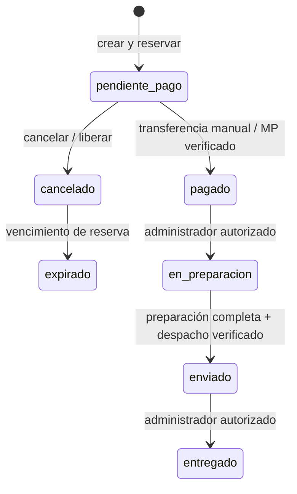

# Preparación operativa y proveedores — 5 octubre 2026

Base revisada: `19e218c7643bbe4ae71f680494386fbb74db02b5`, rama `codex/manual-review-fixes`, PR #4 en borrador. El SHA final y CI exacta están en el informe de cierre externo a Git. Esta revisión es local: no demuestra una homologación de proveedores ni un flujo Cloud real. No autoriza publicación, migraciones Cloud, Storage, DNS, cambios de plan ni activar workers.

## LISTO — comprobado localmente

- Política definitiva: un mate físico no recibe promoción por volumen; dos o más reciben 20% sobre productos. El conteo sale de componentes aprobados, sin duplicar sets ni contar accesorios/termos. Transferencia agrega exclusivamente 10% sobre productos ya descontados. Dos o más mates + transferencia = 28% efectivo; nunca 30%. El costo de envío se suma íntegro.
- SQL recalcula precios, componentes, cantidades y descuentos; ignora valores adulterados del cliente. El carrito, producto, checkout, selector y resumen explican la política vigente.
- Transferencia crea pedido pendiente, conserva instrucciones bancarias aprobadas, reserva 24 horas y solicita comprobante por Instagram/WhatsApp. No existe autoaprobación desde el resultado de compra.
- Confirmación manual existente, fortalecida: administrador, sesión viva, referencia bancaria, actor y fecha, bloqueo concurrente e idempotencia. El panel informa número, importe, contacto, creación, vencimiento y minutos restantes; deshabilita confirmación al vencer. Cancelar/vencer únicamente libera pedidos pendientes.
- Panel minorista: medio y estado de pago, entrega, preparación, tracking verificado e historial. Preparar exige pago; entregar exige despacho. Retenciones financieras bloquean preparación/entrega. No se inventó un botón para despachar sin prueba logística.
- Registro ampliado, perfil, Auth local, confirmación/recovery PKCE, enlaces inválidos/reutilizados/vencidos y aislamiento mayorista A/B. Mailpit recibe únicamente correo local.
- Checkout invitado/autenticado, reservas, cajas, componentes y carreras por última unidad; contratos MP/Resend/MiCorreo con transportes inyectados. Construcción estática y auditor de exposición pública.
- Eventos de correo: recibido pendiente, pagado tras confirmación y despachado solamente con tracking verificado. Destinatario del checkout y enlace privado de pedido con capacidad temporal; no requiere login en la política de invitado. Envelope cifrado, deduplicación y receipts conservados.

## Ciclo reutilizado y modificaciones

Se conserva el enum de pedidos y sus transiciones. `Creado` es el evento inicial; `listo para despacho` es una condición derivada, no un nuevo enum. Exige `en_preparacion`, abastecimiento completo y grabados listos. Los estados de pago se mantienen separados de los del pedido.

Pago rechazado no equivale a despacho ni a reposición inmediata: conserva la gestión de reserva y su vencimiento. Reembolso, reembolso parcial y contracargo generan revisión financiera según el modelo aprobado; no reintegran automáticamente mercadería. Su resolución operativa y una devolución física requieren procedimiento explícito antes de producción. Se añadió auditoría inmutable de transiciones y operaciones administrativas acotadas, sin un motor paralelo.

## Matriz de inventario

| Operación | Disponibilidad y movimiento | Reintento/concurrencia |
|---|---|---|
| Crear pendiente | Descuenta disponibles y registra reservas de cada componente y caja | Una orden por clave; rollback integral si falta una unidad |
| Confirmar pago | Conserva la asignación; no vuelve a descontar | Una confirmación y un evento pagado |
| Preparar/listo/despachar/entregar | Sin segundo descuento ni liberación | Estado esperado, rol y auditoría; despacho verificado |
| Cancelar pendiente | Devuelve cada reserva, incluidas cajas | Una liberación; suma de movimientos vuelve a cero |
| Vencer pendiente a las 24 h | Cancela y marca expirado; devuelve reserva | Locks compartidos con confirmación; ganador válido al límite |
| Confirmar antes del vencimiento | Pasa a pagado y conserva stock | Expiración posterior no revierte el pago |
| Confirmar vencido | Rechazo; nunca resucita stock liberado | Sin nuevo pago/outbox pagado |
| Rechazado pendiente | No se inventa reposición; cancelar/vencer según flujo | Sin marcar aprobado desde navegador |
| Reembolso/contracargo | Retención y revisión financiera | Sin reposición automática de componentes |

Escenarios locales cubiertos: uno/dos/tres mates × MP/transferencia; set de dos mates sin doble conteo; mixto con accesorio; variantes/combos; cajas agregadas por composición; cuchillo/vaina y abastecimiento; stock escaso; dos compradores por última unidad; misma idempotencia concurrente; cancelación/vencimiento repetidos; confirmación frente a vencimiento. Las categorías no convierten un termo, cuchillo o caja en mate físico.

## Logística: listo interno, homologación pendiente

Perfiles operativos existentes: mate 17×17×17 cm (170 mm), referencia 550 g; set 30×30×20 cm (300×300×200 mm), referencia 1.300 g. Son aproximaciones configuradas, no mediciones certificadas. Las pruebas locales cubren un mate, dos mates consolidados según perfil, un set, dos sets y múltiples bultos. La consolidación debe aceptar exclusivamente el perfil operativo aprobado y peso acumulado; que dos sets quepan físicamente en una caja debe verificarlo el operador antes de homologar.

Mayorista conserva embalaje manual flexible y bultos editables con peso/dimensiones antes de cotizar/confirmar; no reserva ni cobra al crear una solicitud. El adaptador exige snapshot y fingerprint coherentes, tarifa vigente y aprobación, sin inventar tracking o etiquetas.

**Pendiente técnico:** `recordVerifiedDispatch` exige lookup del transportista correlacionado a pedido/código/estado. El adaptador real de tracking necesita el contrato oficial y su implementación/homologación. El ensayo con fixture importado y transportes inyectados no demuestra tracking MiCorreo real. Este punto excede cargar credenciales.

## BLOQUEADO POR CREDENCIALES

### Mercado Pago — pedir al dueño de la cuenta

- Credenciales Checkout Pro de la cuenta comercial y ambiente autorizado: `MP_ACCESS_TOKEN`, `MP_COLLECTOR_ID`, `MP_ENVIRONMENT` y contrato explícito booleano `MP_EXPECTED_LIVE_MODE`.
- Secreto de firma `MERCADOPAGO_WEBHOOK_SECRET`; recibirlo mediante gestor seguro, nunca Git, chat, capturas o informes. `MP_PUBLIC_KEY` no es usado por el redirect Checkout Pro actual.
- Dominio HTTPS aprobado en `APP_ORIGIN`; redirects success/pending/failure van a `/checkout/resultado?pedido=…`; notificación a `/api/pagos/mercadopago/webhook`.
- Cambiar `PAYMENTS_MODE=real` solamente en activación autorizada. Ensayar primero ambiente test y confirmar cuenta, importe ARS, external_reference, metadata, idempotencia, approved/pending/rejected, firmas inválidas, repetidos, retry y conciliación. El redirect público nunca confirma el pago.
- `PAYMENT_RECONCILIATION_ENABLED` permanece 0 hasta habilitación separada. Los contratos locales de preferencias/webhooks/reembolsos no son cobros reales.

### MiCorreo — pedir contrato API y homologación

- `CORREO_MICORREO_USER`, `CORREO_MICORREO_PASSWORD`, `CORREO_MICORREO_CUSTOMER_ID`, `CORREO_MICORREO_ENVIRONMENT`, `CORREO_ORIGIN_POSTAL_CODE`. Son credenciales API, no el login habitual del portal.
- Origen, servicios, límites y bultos aprobados; `CORREO_VERIFIED_PARCELS_JSON` solamente con mediciones verificadas para productos fuera de perfiles mate/set.
- Documentación oficial y acceso al lookup de tracking y correlación de importación. Completar el pendiente técnico anterior antes de afirmar despacho real.
- `SHIPPING_MODE=real` únicamente con autorización y E2E test. No usar scraping del sitio público ni tracking inventado.

### Resend / SMTP / Auth

- Identidad futura única: **MateBreak <contacto@matebreak.com.ar>**; Reply-To **Mate.break32@gmail.com**. Sustituye la identidad propuesta anteriormente en informes históricos.
- Dominio verificado y `RESEND_API_KEY`, `RESEND_FROM_EMAIL`, `RESEND_REPLY_TO`, `RESEND_WEBHOOK_SECRET` para receipts; `EMAIL_ENVELOPE_KEY` AES-256-GCM de 32 bytes en gestor de secretos. No generar secretos en esta revisión.
- Inicialmente mantener `EMAILS_ENABLED=0`, `EMAIL_WORKER_ENABLED=0`, `EMAIL_RECEIPTS_ENABLED=0`, `AUTH_RECOVERY_ENABLED=0` en Cloud. El preview local habilita recovery exclusivamente contra Auth/Mailpit local.
- Primera prueba futura: un solo evento y destinatario permitido mediante `EMAIL_TEST_EVENT_ID` y `EMAIL_TEST_RECIPIENT=Mate.break32@gmail.com`, con autorización específica. No vaciar outbox histórico. Fijar `EMAIL_ROLLOUT_AFTER` para rollout posterior; los históricos anteriores quedan excluidos.
- Configurar SMTP Supabase con endpoint/puerto/usuario/password proporcionados por Resend y sender aprobado. Registrar URL de sitio, allowlist exacta de callbacks Staging y producción, templates de confirmación y recovery, expiración y política OTP/PKCE. No copiar allowlists abiertas entre entornos.
- E2E real separado: recibido, transferencia pendiente, pagado y despacho con tracking; recipient checkout, capability privada expira/no se comparte; bounces/receipts firmados/retries/dedupe. Ningún email externo salió aquí.

### DonWeb DNS — checklist para el titular

- Inventariar zona y NS vigentes antes de editar. Preservar Tiendanube, web, MX y correo existentes.
- Copiar nombres/valores DKIM y verificación exactos que emita Resend; no inventarlos. SPF: un solo registro y combinación correcta con remitentes existentes; no reemplazo ciego.
- Configurar Return-Path/MX/TXT sólo donde el proveedor solicite. DMARC con política y recepción de informes aprobadas por titular; verificar alineación SPF/DKIM.
- Esperar propagación, verificar dominio en proveedor y probar un email autorizado antes de rollout. La zona no fue consultada ni modificada aquí.

## BLOQUEADO POR DECISIÓN ECONÓMICA

El lote original conserva 610 archivos / 797.445.378 bytes. Las copias activas producción + Staging darían al menos 1.594.890.756 bytes vivos; el promedio del período no es espacio libre. El análisis previo de la organización Free concluyó que no es sostenible duplicarlo bajo 1 GB. Pro: referencia previa 100 GB y aproximadamente USD 35/mes para organización con dos Micro activos (USD 25 + compute neto aproximado USD 10), antes de impuestos/extras. Es una estimación anterior, no cotización nueva ni cambio de plan. Reconfirmar plan, precios, consumo promedio/vivo y proyecto pausado al autorizar. Transferencia de imágenes se factura/limita aparte.

## BLOQUEADO POR AUTORIZACIÓN CLOUD

1. Revalidar candidato final/CI, identidad de proyectos, baseline comercial, seis hashes y DB37; detener ante cualquier divergencia adicional.
2. Aprobar capacidad, crear únicamente bucket Staging revisado y subir originales con hashes, MIME, permisos y reintentos auditados. No tocar producción ni eliminar originales.
3. Migración 38 estaba pendiente: se corrige en lugar de publicar primero la regla obsoleta. Se actualizan lock y equivalencia. Nueva **39** contiene operaciones/auditoría minoristas y allowlist de sesión. **1–37 no cambian**. Cloud continúa con 37 según último informe; esta ejecución no lo vuelve a medir ni aplica 38/39.
4. Preservar paquete catálogo: 106 productos, 217 variantes, 929 referencias, 610 originales, delta de 1.358 actualizaciones, mappings/componentes e inventario/movimientos. No regenerarlo por esta corrección.
5. Ensayar 37→38→39 contra copia aislada y contrastar esquema/ACL/RLS/hashes, tomar backup nuevo antes de cada operación futura autorizada. No repetir migraciones ya aplicadas, repair ni rollback DB32.
6. Construir prebuilt nuevo del SHA final; el prebuilt de `19e218c` queda obsoleto. El build local actual contiene **176 archivos estáticos**, manifiesto separado, sin backend/SQL/secretos. Publicar Render commit exacto y comprobar Live/health antes de Vercel; `--prod` solamente con identidad comprobada del proyecto Staging. Nada fue desplegado aquí.
7. Smoke Cloud sin mutaciones y después cuentas/pedidos/eventos sintéticos sólo con autorización específica, baseline antes/después y plan de recuperación. PR #4 permanece borrador y main sin merge.

## Observabilidad y recuperación

Se reutilizan request IDs, logging estructurado y sanitizado, health `/healthz`, auditoría administrativa y eventos de outbox. Workers existentes usan claims/leases, intentos acotados, deduplicación y clasificación de fallos; la reserva de stock no depende de enviar el email. Mantener scheduler apagado. Health HTTP 200 no certifica proveedor, DNS ni conciliación.

Alertas preparables sin envío: revisar manualmente health, errores correlacionados, outbox fallido/en lease vencido, edad de pendientes, discrepancias MP y retenciones financieras. Antes de operar a diario se debe asignar responsable, periodicidad, umbrales y destino de alertas. No se creó un servicio pago ni una notificación externa.

DB37 portable previamente restaurado aislado: `staging-db37-portable.mbbk`, SHA-256 `9e34a9af7123638a2992758080095400fa935019a2e41ecc11203e251363cc7e`, 1.493.101 bytes. No se regeneró ni se leyó su clave. Custodia externa y prueba desde ambas copias siguen pendientes del titular: copiar cifrado, guardar clave separada, verificar ambas copias y descifrar en memoria mediante verificador aprobado. Backup legado DB32 depende del perfil Windows y DPAPI; no constituye recuperación independiente del equipo. Persisten temporales descifrados protegidos pendientes de gestión; no se eliminaron ni se eludió el bloqueo anterior de limpieza.

## BLOQUEADO PARA PRODUCCIÓN — lista pendiente

- Capacidad económica y recuperación íntegra de fotografías; catálogo comercial todavía no publicado en Staging.
- Autorizar/ensayar/aplicar 38 y 39, nuevo candidato coordinado, prebuilt nuevo, smoke y validación Cloud real.
- Credenciales y homologación MP; MiCorreo, mediciones físicas y contrato/implementación real de tracking.
- DNS, remitente verificado, SMTP Auth y Resend; prueba controlada inicial y rollout posterior autorizado.
- Validación E2E real de pago, reserva, correo, importación, seguimiento, despacho, entrega y errores; mocks no la sustituyen.
- Procedimiento y responsables de devoluciones/contracargos/retenciones, expiración y cola de emails; activación y monitoreo explícitos de workers/scheduler cuando corresponda.
- Custodia externa comprobada del backup portable y gestión autorizada de temporales; ensayo actualizado antes de mutar Cloud.
- Aprobación independiente de producción, integración final de PR #4/main y transición desde Tiendanube. La presente revisión no autoriza ni realiza esos pasos.

## Reproducción local y traspaso

Usar Node 22 y únicamente los contenedores owned con guard de worktree. `npm test`; `node scripts/test-local.mjs`; ensayos aislados guest/manual-review/transfer-policy/retail-operations/commercial/preproduction/wholesale-account/wholesale-commercial. Auth+Mailpit: `node scripts/test-manual-review-auth.mjs` contra preview local recién reseteado. Los scripts rechazan URLs Cloud y credenciales heredadas.

Comprobar `node scripts/audit-baseline.mjs --check`, `node scripts/check-commercial-migrations.mjs`, `npm run catalog:historical:check`, `npm run build:staging` con `STAGING_BACKEND_ORIGIN` revisado, `node scripts/audit-guest-artifact.mjs` y `npm audit`. CI fija checkout al SHA de PR y ejecuta Node/build/auditor/locks además de los nuevos SQL en Docker sin red publicada.

Al terminar detener preview, limpiar sólo fixtures mediante reset local guardado y detener Supabase/containers propios. No tocar backups ni temporales protegidos. La siguiente ejecución debe leer el cierre, verificar HEAD/CI y esperar autorización Cloud; no encadenar publicación ni activación.
