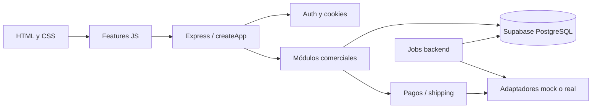
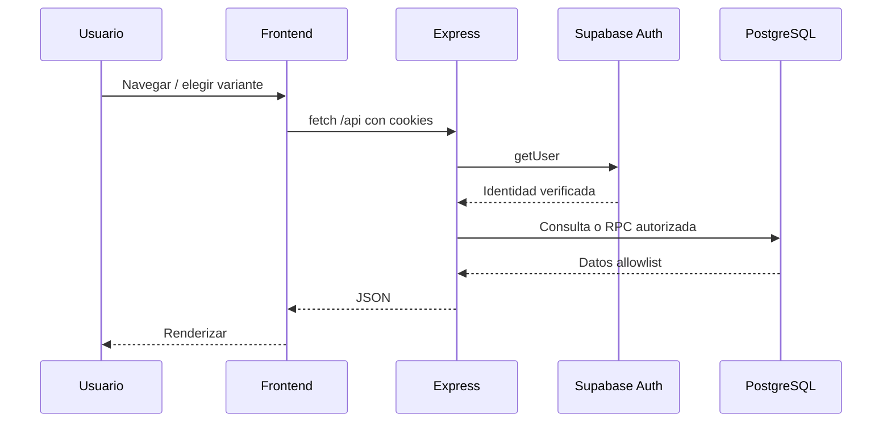
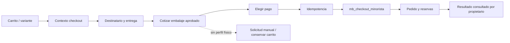
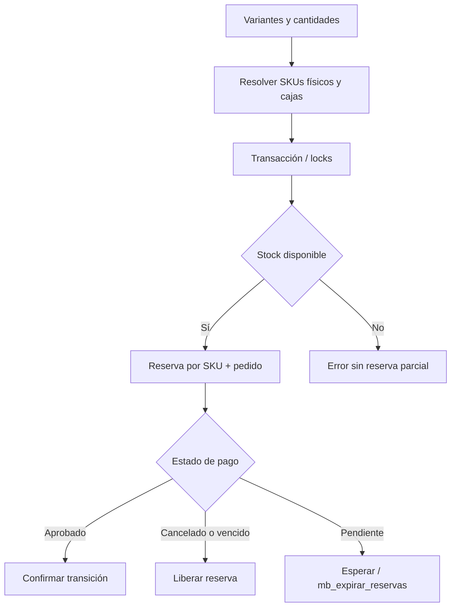
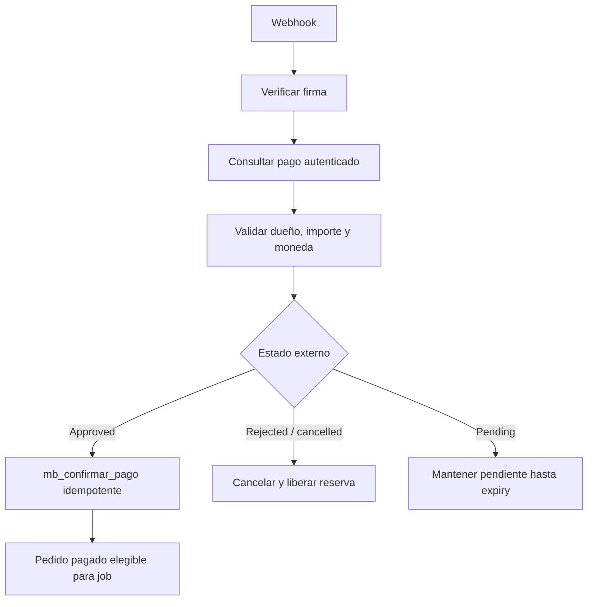
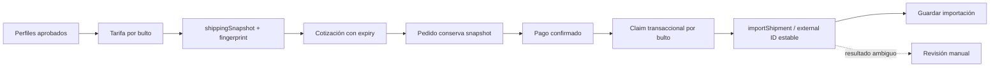
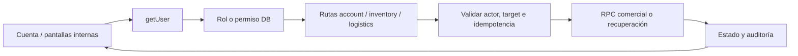
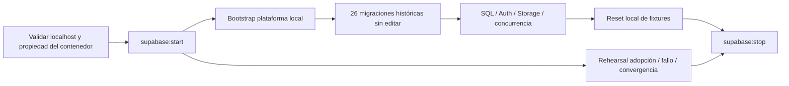

# Flujos principales

Los proveedores reales dibujados representan el contrato diseñado, pendiente de validación oficial. Los tests de esta iteración se ejecutan con mocks y Supabase local.

## Arquitectura

## Usuario, frontend, backend y Supabase

## Carrito, checkout y pedido

En mock normal, `createMockCheckoutStore` sustituye la rama RPC/persistencia; no hay reserva real. La persistencia mock local sí usa esa rama SQL.

## Reserva de stock

## Pago aprobado o rechazado

Los tests mock llaman su camino de simulación; no forjan un webhook de proveedor real. Transferencias pasan por `transferAdminRoutes` y `mb_confirmar_transferencia`, con autorización de administrador.

## Cotización, snapshot e importación MiCorreo

## Administración

## Migraciones locales

Los scripts locales no admiten targets remotos ni credenciales heredadas. No hay flecha de este flujo a producción.
