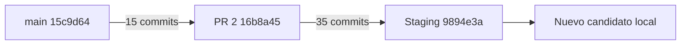

# Integración de PR #2 y desarrollo posterior

Inspección remota read-only del 4 de octubre de 2026:

| Referencia | Commit |
| --- | --- |
| main | `15c9d640075b52721d81be033ba647cef9f3988b` |
| PR #2, OPEN | `16b8a45cbe9b9955d2b844690836030335006d44` |
| codex/staging-preparation / Staging publicado | `9894e3a8dffdf983ae3e90030812a0af3f66d194` |
| Nuevo candidato | Rama local `codex/wholesale-registration`, descendiente de 9894e3a; HEAD exacto en informe externo |

Los merge-base comprobados son main para main/PR2 y PR2 para PR2/Staging. Es una cadena ancestral: la integración Git actual admite fast-forward y no presenta divergencia de contenido. No se simuló una resolución de conflictos ni se modificó main. Repetir ancestry cuando cambie cualquier referencia.

PR2 cubre baseline Supabase/logística auditada: 171 archivos frente a main. Staging incorpora otros 35 commits, incluyendo refactor, arreglos funcionales, checkout invitado, mocks persistentes, catálogo y acceso mayorista; diff acumulado main→9894: 330 archivos, 81.275 inserciones/1.609 eliminaciones. Gran parte es datos/assets/SQL/docs; revisar por áreas, no tratar volumen como código ejecutable. El candidato añade corrección de CTAs, registro contextual, perfil comercial/RPC y validaciones locales.

## Estrategia que conserva commits

Después de validar/publicar el candidato en Staging con autorización, elegir explícitamente actualizar por fast-forward la rama de PR2 hasta el candidato o crear un PR de integración completo candidato→main. Para actualizar PR2 hay que autorizar su modificación; no se hizo aquí. Reescribir título/descripción alrededor del resultado final. Preservar la cadena con merge commit o fast-forward permitido; evitar squash/rebase si deben conservarse estos IDs. Integrar únicamente el viejo head de PR2 dejaría fuera 35 commits y esta iteración.

Fuente exclusiva: Git HEAD comprometido/artefacto de `git archive`, nunca copiar el Desktop completo. El checkout principal mantiene una modificación local `.env.example` fuera del candidato. Archivos pendientes antiguos, `.env`, logs, dumps, evidencias y snapshots fuera de Git no se incorporan. Verificar `git status`, diff y manifest antes de cualquier acción remota.

CI Security checks actual de PR2: SUCCESS run `36875968149`, job `110415359371`; Supabase Preview SKIPPED. Ese resultado corresponde al head viejo y no valida el candidato nuevo. CI existente corre npm ci/test, baseline --check, catálogo histórico y npm audit con Node22. No cubre Chrome/SQL; adjuntar evidencia local de esas suites y proponer jobs aislados antes de producción, sin abrir acceso Cloud al CI.

## Rollback de aplicación y checklist

El cambio de perfil es aditivo: tras aplicar migración32, puede volver aplicación a 9894e3a conservando columnas/RPC/datos nuevos; ensayar versión anterior contra esquema32 antes de elegirlo como rollback. No retirar columnas ni restaurar base automáticamente. Las solicitudes/pagos/stock previos no se revierten. Volver a una versión anterior a la protección de cuentas mayoristas sería una regresión de seguridad y queda excluido.

- Referencias exactas y diff revisados; secretos/pendientes excluidos, working tree limpio.
- Node22, SQL/RLS/concurrencia, Chrome1440/360, checkout invitado y artefacto auditado.
- CI del HEAD exacto en SUCCESS y nuevas revisiones de cambios posteriores.
- Baseline y hashes remotos reconfirmados; backups y ensayo de la única migración nueva.
- Sesiones sensibles, contracargos, limitador y workers resueltos para producción; correo/DNS y proveedores homologados con autorización propia.
- Rollback compatible ensayado, alertas/conciliación y responsable durante ventana de publicación.
- Autorizar por separado publicación Staging, integración/merge y activación comercial; ningún consentimiento se infiere del informe local.
